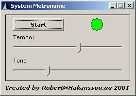



## A simple way to use the "Beep API" as a metronome\.

### Description

This short and simple code handles the Beep API, whitch to use in Windows NT & 2K... As far as i know. In this case i have used the Beep API as a metronome. Perfect if you are playing a instrument! :)
 
### More Info
 

             |
---                |---
**Submitted On**   |2001-12-11 16:03:14
**By**             |[Robert Håkansson](https://github.com/Planet-Source-Code/PSCIndex/blob/master/ByAuthor/robert-h-kansson.md)
**Level**          |Beginner
**User Rating**    |5.0 (20 globes from 4 users)
**Compatibility**  |VB 6\.0
**Category**       |[Sound/MP3](https://github.com/Planet-Source-Code/PSCIndex/blob/master/ByCategory/sound-mp3__1-45.md)
**World**          |[Visual Basic](https://github.com/Planet-Source-Code/PSCIndex/blob/master/ByWorld/visual-basic.md)
**Archive File**   |[A\_simple\_w4111112112001\.zip](https://github.com/Planet-Source-Code/robert-h-kansson-a-simple-way-to-use-the-beep-api-as-a-metronome__1-29666/archive/master.zip)

